# Chi tiết chức năng Solution `AmThucVinhKhanh.sln`

## 1. Tổng quan solution

Solution hiện có 3 project chính dùng cho hệ thống:

- `VinhKhanhFood.App`
  - Ứng dụng MAUI cho khách du lịch.
  - Chức năng chính: xem POI, bản đồ, quét QR, nghe audio, gửi heartbeat online/location/audio.
- `VinhKhanhFood.API`
  - ASP.NET Core Web API.
  - Chức năng chính: quản lý dữ liệu POI, user/visitor, lịch sử sử dụng, heartbeat, thanh toán mock.
- `VinhKhanhFood.Admin`
  - Web CMS cho Admin/Owner.
  - Chức năng chính: đăng nhập quản trị, CRUD POI, xem QR, trang public, thống kê usage, theo dõi visitor.

Project phụ:

- `CheckUsers`
  - Utility project hỗ trợ kiểm tra dữ liệu.

---

## 2. Các file/chức năng chính theo project

### 2.1. `VinhKhanhFood.App`

Các file chính:

- [App.xaml.cs](C:\Users\sangl\source\repos\AmThucVinhKhanhnew\VinhKhanhFood.App\App.xaml.cs)
  - Khởi tạo app, xử lý deep link QR, reload UI khi đổi ngôn ngữ, gắn heartbeat audio.
- [AppShell.xaml](C:\Users\sangl\source\repos\AmThucVinhKhanhnew\VinhKhanhFood.App\AppShell.xaml)
  - Điều hướng tab `Map`, `Explore`, `Scan`, `Settings`.
- [MainPage.xaml.cs](C:\Users\sangl\source\repos\AmThucVinhKhanhnew\VinhKhanhFood.App\MainPage.xaml.cs)
  - Hiển thị map, POI pin, tìm kiếm POI, mở bottom sheet.
- [ExplorePage.xaml.cs](C:\Users\sangl\source\repos\AmThucVinhKhanhnew\VinhKhanhFood.App\ExplorePage.xaml.cs)
  - Danh sách POI nổi bật và POI gần đó.
- [DetailPage.xaml.cs](C:\Users\sangl\source\repos\AmThucVinhKhanhnew\VinhKhanhFood.App\DetailPage.xaml.cs)
  - Hiển thị chi tiết POI và phát audio mặc định.
- [ScanQrPage.xaml.cs](C:\Users\sangl\source\repos\AmThucVinhKhanhnew\VinhKhanhFood.App\ScanQrPage.xaml.cs)
  - Quét QR bằng camera hoặc nhập tay.
- [SettingsPage.xaml.cs](C:\Users\sangl\source\repos\AmThucVinhKhanhnew\VinhKhanhFood.App\SettingsPage.xaml.cs)
  - Đổi ngôn ngữ và xem thông tin version.
- [ApiService.cs](C:\Users\sangl\source\repos\AmThucVinhKhanhnew\VinhKhanhFood.App\Services\ApiService.cs)
  - Lấy danh sách POI từ API.
- [AuthService.cs](C:\Users\sangl\source\repos\AmThucVinhKhanhnew\VinhKhanhFood.App\Services\AuthService.cs)
  - Quản lý guest presence, location heartbeat, audio heartbeat.
- [AudioGuideService.cs](C:\Users\sangl\source\repos\AmThucVinhKhanhnew\VinhKhanhFood.App\Services\AudioGuideService.cs)
  - Phát audio mặc định từ mô tả hoặc audio file upload.
- [UsageTrackingService.cs](C:\Users\sangl\source\repos\AmThucVinhKhanhnew\VinhKhanhFood.App\Services\UsageTrackingService.cs)
  - Ghi log `VIEW_DETAIL`, `AUDIO_PLAY`.
- [MapViewModel.cs](C:\Users\sangl\source\repos\AmThucVinhKhanhnew\VinhKhanhFood.App\ViewModels\MapViewModel.cs)
  - Load POI, theo dõi geolocation, auto-play POI gần nhất.

### 2.2. `VinhKhanhFood.API`

Các file chính:

- [FoodController.cs](C:\Users\sangl\source\repos\AmThucVinhKhanhnew\VinhKhanhFood.API\Controllers\FoodController.cs)
  - CRUD POI, approve/reject, usage history cho POI.
- [UserController.cs](C:\Users\sangl\source\repos\AmThucVinhKhanhnew\VinhKhanhFood.API\Controllers\UserController.cs)
  - User/visitor presence, guest tracking, visitor location, audio heartbeat.
- [PaymentController.cs](C:\Users\sangl\source\repos\AmThucVinhKhanhnew\VinhKhanhFood.API\Controllers\PaymentController.cs)
  - Mock checkout, payment dashboard, unlock audio.
- [DbInitializer.cs](C:\Users\sangl\source\repos\AmThucVinhKhanhnew\VinhKhanhFood.API\Data\DbInitializer.cs)
  - Tự tạo/mở rộng schema SQLite và seed dữ liệu demo.
- [AppDbContext.cs](C:\Users\sangl\source\repos\AmThucVinhKhanhnew\VinhKhanhFood.API\Data\AppDbContext.cs)
  - DbSet cho `FoodLocations`, `Users`, `UsageHistories`, `PaymentTransactions`, `PoiAudioUnlocks`.
- [UserPresenceService.cs](C:\Users\sangl\source\repos\AmThucVinhKhanhnew\VinhKhanhFood.API\Services\UserPresenceService.cs)
  - Tính `Online/Offline`, đếm active traveler, build tên `guid`.

### 2.3. `VinhKhanhFood.Admin`

Các file chính:

- [AccountController.cs](C:\Users\sangl\source\repos\AmThucVinhKhanhnew\VinhKhanhFood.Admin\Controllers\AccountController.cs)
  - Đăng nhập quản trị, logout, quan sát user/visitor.
- [PoiController.cs](C:\Users\sangl\source\repos\AmThucVinhKhanhnew\VinhKhanhFood.Admin\Controllers\PoiController.cs)
  - CRUD POI, approve/reject, xem `Audio QR`.
- [UsageController.cs](C:\Users\sangl\source\repos\AmThucVinhKhanhnew\VinhKhanhFood.Admin\Controllers\UsageController.cs)
  - Dashboard usage, device history, heatmap, live listener, visitor theo vùng.
- [PublicController.cs](C:\Users\sangl\source\repos\AmThucVinhKhanhnew\VinhKhanhFood.Admin\Controllers\PublicController.cs)
  - Trang public web cho POI/subscription demo.
- [Views\Account\Users.cshtml](C:\Users\sangl\source\repos\AmThucVinhKhanhnew\VinhKhanhFood.Admin\Views\Account\Users.cshtml)
  - Danh sách user/guid online-offline.
- [Views\Usage\Index.cshtml](C:\Users\sangl\source\repos\AmThucVinhKhanhnew\VinhKhanhFood.Admin\Views\Usage\Index.cshtml)
  - Dashboard thống kê và live monitoring.
- [Views\Public\Poi.cshtml](C:\Users\sangl\source\repos\AmThucVinhKhanhnew\VinhKhanhFood.Admin\Views\Public\Poi.cshtml)
  - Trang public POI.

---

## 3. Luồng chức năng chính và Sequence Mermaid

## 3.1. Khởi động app và tải shell

### Chức năng

App khởi động, nạp `AppShell`, đăng ký theo dõi thay đổi ngôn ngữ, deep link QR và trạng thái audio.

### Sequence

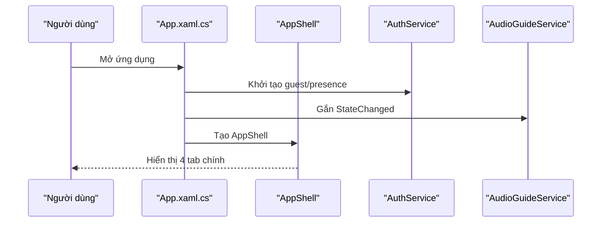

### Mô tả luồng

Khi app mở, `App.xaml.cs` tạo `AuthService` và `AudioGuideService`, sau đó dựng `AppShell` với 4 tab chính. Đây là điểm bắt đầu của toàn bộ trải nghiệm người dùng.

---

## 3.2. Xem bản đồ POI và tự phát audio gần nhất

### Chức năng

Trang map tải POI từ API, vẽ pin lên bản đồ, theo dõi vị trí và tự phát audio cho POI đủ gần.

### Sequence

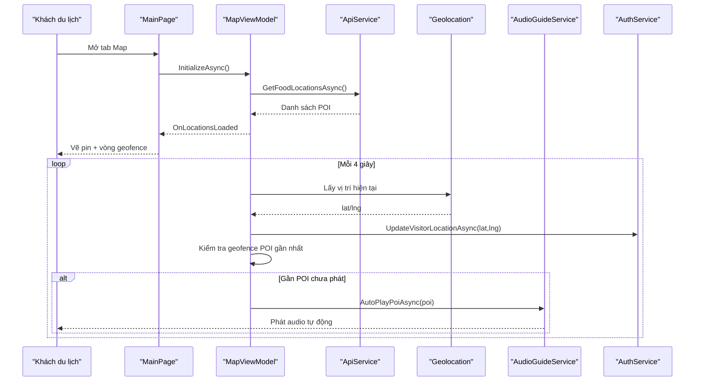

### Mô tả luồng

Map page không chỉ hiển thị vị trí POI mà còn là nơi phát hiện visitor đang đến gần POI nào. Vị trí visitor được gửi về server để CMS biết visitor đang ở vùng nào, đồng thời audio POI gần nhất được phát tự động.

---

## 3.3. Khám phá danh sách POI

### Chức năng

Trang Explore tải danh sách POI, hiển thị nhóm nổi bật và danh sách nearby, người dùng chọn item để vào trang chi tiết.

### Sequence

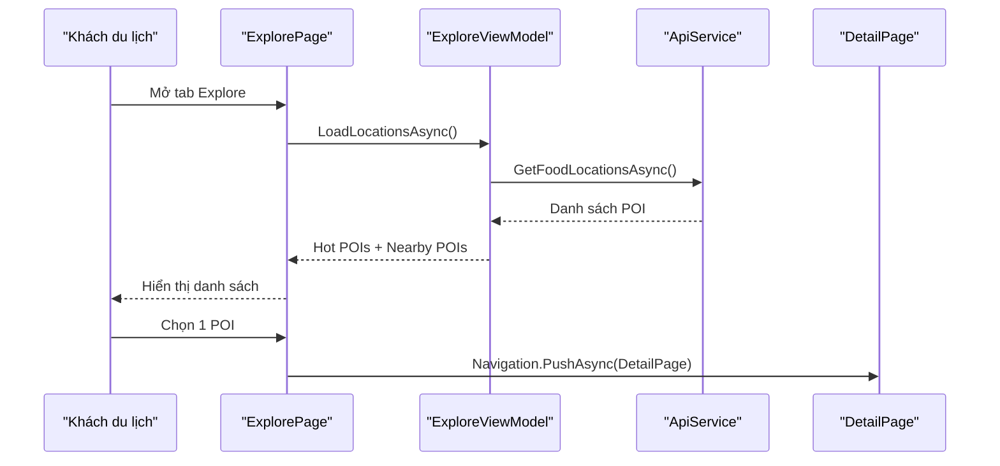

### Mô tả luồng

Explore page đóng vai trò như một danh mục POI nhanh. Người dùng có thể duyệt các địa điểm nổi bật rồi vào chi tiết mà không cần thao tác trên bản đồ.

---

## 3.4. Xem chi tiết POI và nghe audio mặc định

### Chức năng

Trang chi tiết hiển thị ảnh, mô tả và phát audio mặc định. Đồng thời ghi log xem chi tiết và log nghe audio.

### Sequence

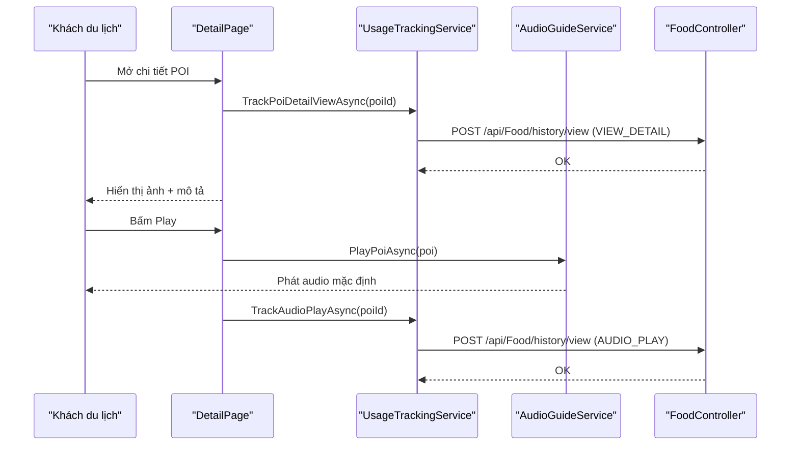

### Mô tả luồng

Mỗi lần người dùng vào chi tiết POI, hệ thống ghi lại hành vi xem. Khi người dùng bấm phát audio, app phát audio mặc định và đồng thời ghi một log `AUDIO_PLAY` để phục vụ thống kê.

---

## 3.5. Quét QR Audio hoặc nhập QR thủ công

### Chức năng

Trang Scan QR cho phép quét mã bằng camera hoặc nhập tay. App sẽ mở POI tương ứng nếu QR hợp lệ.

### Sequence

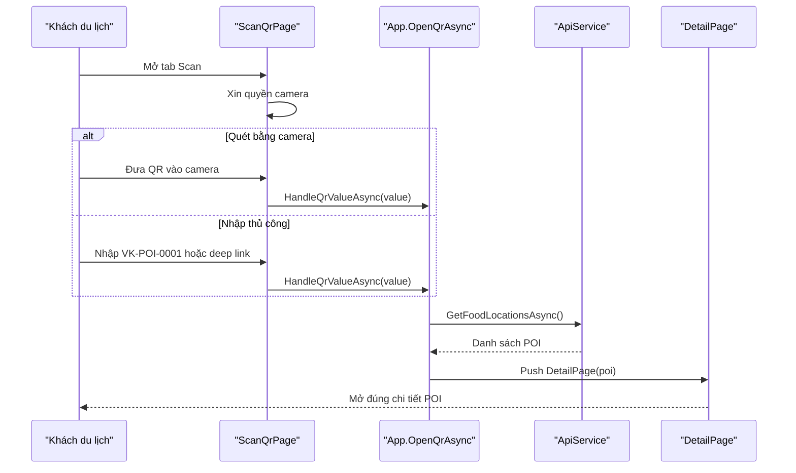

### Mô tả luồng

QR scan là điểm nối giữa không gian thật và nội dung số. App chấp nhận cả QR camera lẫn mã nhập tay để thuận tiện test trên giả lập hoặc khi không dùng camera.

---

## 3.6. Presence heartbeat: online/offline visitor

### Chức năng

Mỗi guest visitor được gắn một `guid`. App gửi heartbeat lên API để cập nhật trạng thái online/offline.

### Sequence

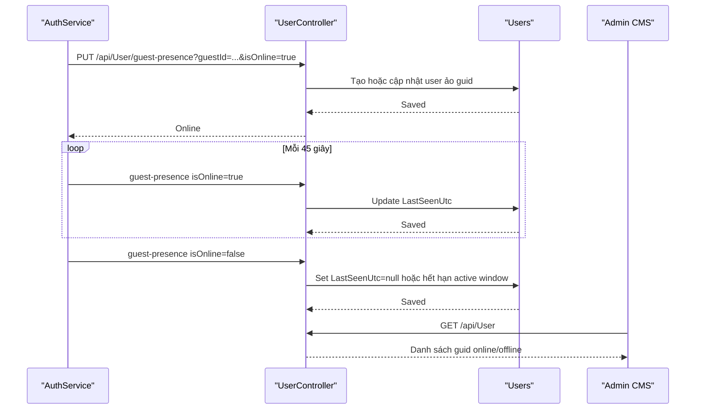

### Mô tả luồng

Đây là luồng dùng để biết hiện có bao nhiêu visitor đang dùng app. Mỗi thiết bị guest được biểu diễn thành một tài khoản ảo `guid`.

---

## 3.7. Visitor location heartbeat và POI theo vùng

### Chức năng

App gửi vị trí visitor lên API. Backend tính visitor đang ở `AT_POI`, `BETWEEN_POIS`, hay `OUTSIDE_POI_ZONE`.

### Sequence

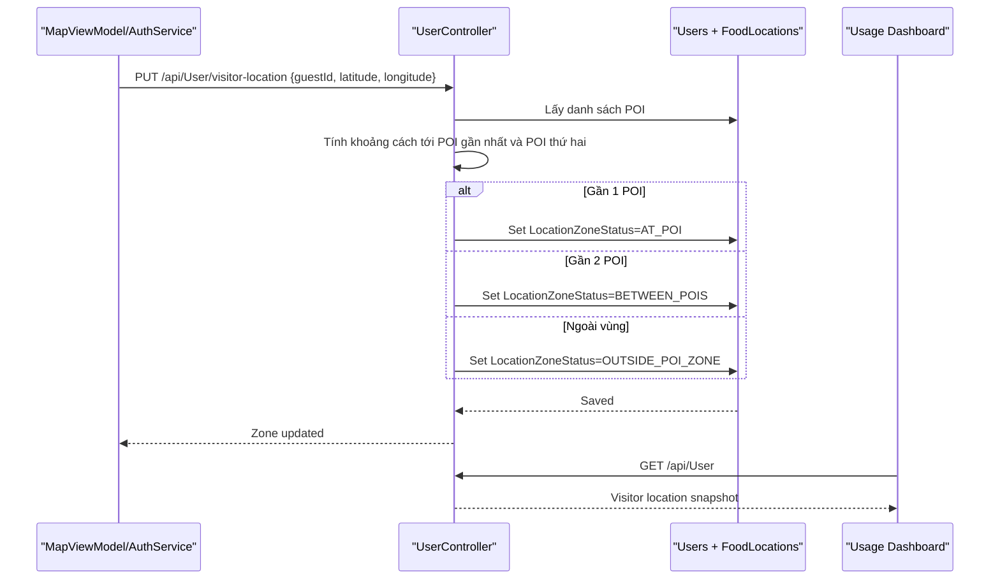

### Mô tả luồng

Chức năng này dùng để xác định visitor đang đứng trước quán nào hoặc đang đứng giữa hai quán. Dashboard admin từ đó có thể hiển thị số visitor đang ở từng POI hoặc giữa hai POI.

---

## 3.8. Audio heartbeat và nhiều người cùng nghe 1 POI

### Chức năng

Khi audio đang phát, app gửi `audio-heartbeat` định kỳ để CMS biết có bao nhiêu người đang nghe cùng một POI. Audio vẫn phát local trên mỗi thiết bị, không cần queue phát audio ở server.

### Sequence

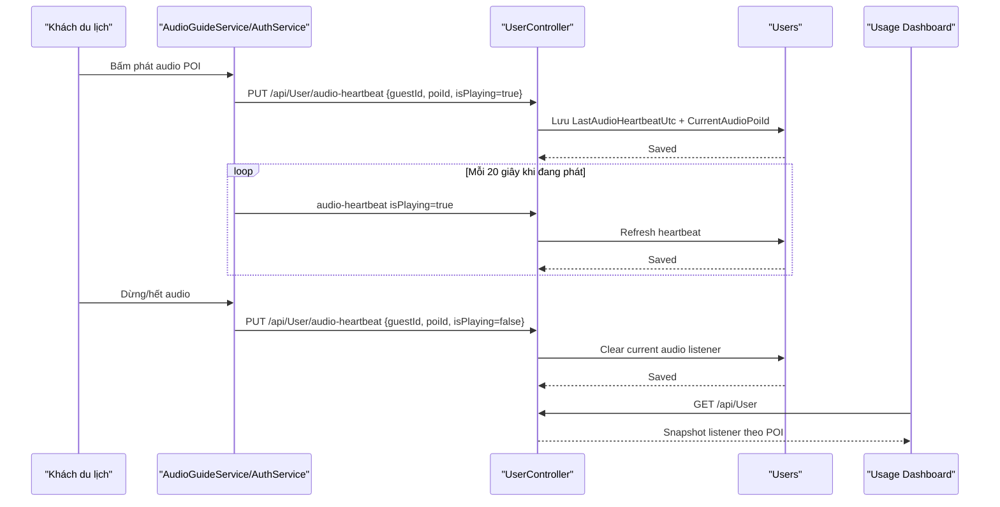

### Mô tả luồng

Nhiều visitor có thể nghe cùng một POI mà không bị nghẽn, vì mỗi máy phát audio cục bộ. Hệ thống chỉ dùng heartbeat để hiển thị “live listener queue” trong CMS, tức là danh sách người đang nghe, chứ không queue luồng phát trên server.

---

## 3.9. CRUD POI trong CMS

### Chức năng

Admin/Owner đăng nhập web, tạo mới/sửa/xóa/duyệt POI.

### Sequence

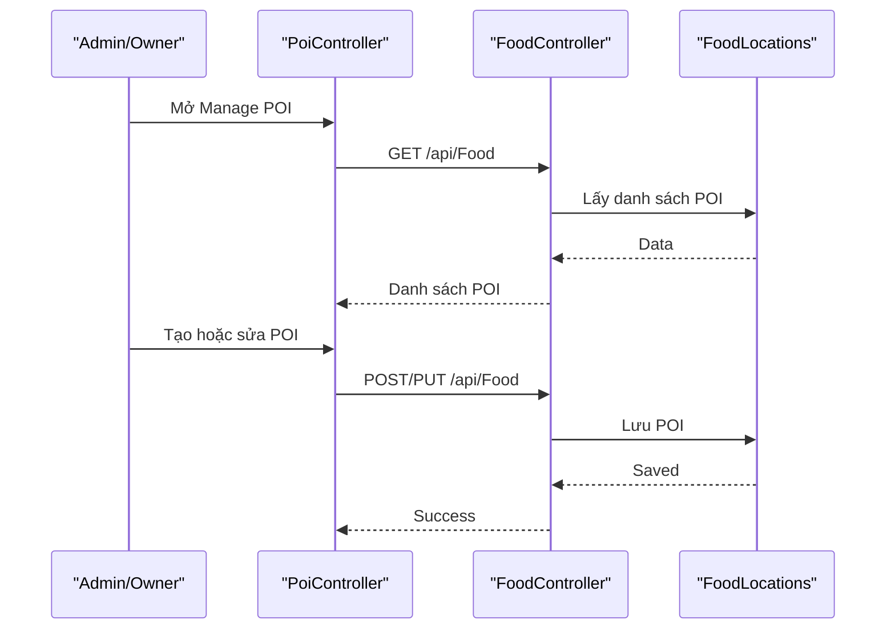

### Mô tả luồng

CMS là nơi quản trị dữ liệu POI. Owner có thể tạo/sửa POI của mình, còn Admin có thể duyệt hoặc từ chối POI.

---

## 3.10. Xem Audio QR của POI

### Chức năng

CMS lấy `Id` của POI, sinh QR Audio và hiển thị cho owner/admin dùng hoặc in ra.

### Sequence

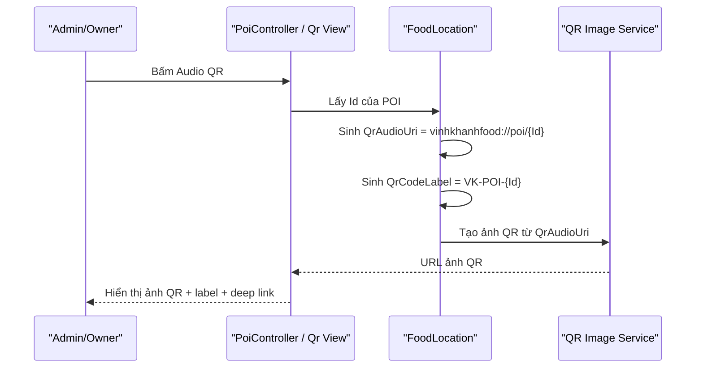

### Mô tả luồng

Audio QR giúp mỗi POI có mã riêng. Khi quét mã này trong app, app sẽ mở đúng POI tương ứng.

---

## 3.11. Public web page và gói truy cập trên web

### Chức năng

`PublicController` cung cấp trang web public cho POI và một cơ chế subscription demo theo `GuestId` cookie.

### Sequence

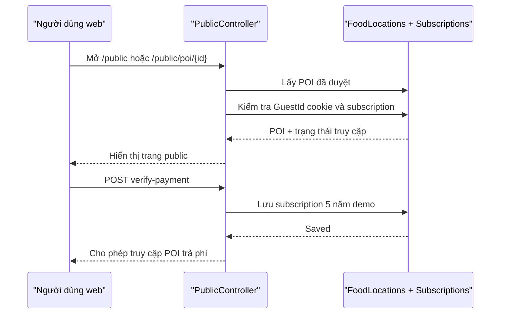

### Mô tả luồng

Đây là nhánh public web ngoài app. Người dùng truy cập trang public, hệ thống kiểm tra cookie/subscription và mở nội dung theo quyền truy cập.

---

## 3.12. Usage Dashboard trong CMS

### Chức năng

Dashboard usage lấy lịch sử sử dụng, danh sách visitor/device và POI để thống kê:

- online hiện tại
- thiết bị 24h / tháng này
- lượt xem POI
- lượt nghe audio
- heatmap theo POI
- visitor tại POI / giữa 2 POI
- live audio queue

### Sequence

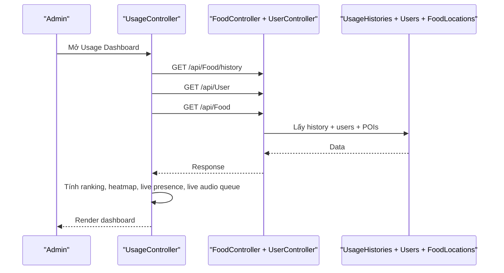

### Mô tả luồng

Đây là nơi tổng hợp toàn bộ dữ liệu vận hành của hệ thống, từ usage history đến visitor live monitoring. Dashboard đóng vai trò quan trọng trong đồ án vì thể hiện được trạng thái hệ thống theo thời gian thực và theo chu kỳ.

---

## 4. Kết luận

Solution hiện tại có 3 trục chức năng chính:

- `Trải nghiệm khách du lịch trên app`
  - bản đồ, danh sách POI, quét QR, audio, heartbeat
- `Xử lý nghiệp vụ ở backend`
  - POI, user/guid, visitor region, audio listener, payment mock
- `Điều hành và quan sát qua CMS`
  - CRUD POI, QR, public page, usage dashboard, live monitoring

Điểm nổi bật của hệ thống hiện tại:

- Mỗi visitor guest được theo dõi bằng `guid`
- Có tracking vị trí visitor theo POI/vùng
- Có tracking nhiều người nghe audio cùng lúc
- Có QR audio và public web flow
- Có dashboard thống kê và heatmap cho đồ án
